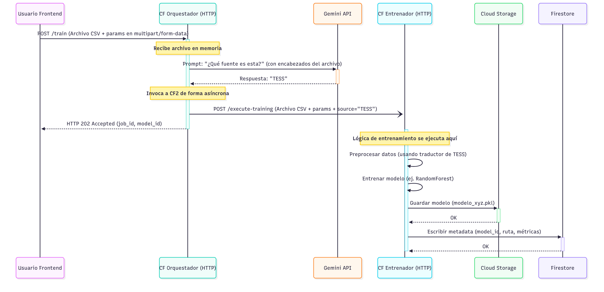

# exo-mint – Backend Serverless para análisis de exoplanetas en GCP
Este repositorio implementa una arquitectura serverless basada en Google Cloud Functions, diseñada para el procesamiento automatizado, entrenamiento de modelos de machine learning y gestión de datos astronómicos de exoplanetas. El backend está desarrollado en Python 3.12 y aprovecha servicios gestionados de GCP como Firestore, Cloud Storage, Cloud Tasks y Vertex AI.


## Diagrama de flujo: Entrenamiento de modelo

El siguiente diagrama ilustra el flujo completo para el entrenamiento de un modelo de exoplanetas usando las Cloud Functions y servicios de GCP:



**Descripción técnica:**
- El usuario envía un archivo CSV y parámetros vía HTTP al orquestador.
- El orquestador identifica el tipo de dataset usando IA (Gemini API), verifica duplicados y encola la tarea de entrenamiento.
- El entrenador recibe la tarea, preprocesa los datos, entrena el modelo y guarda el resultado en Cloud Storage.
- La metadata del modelo y métricas se almacenan en Firestore para su consulta posterior.


## Arquitectura y flujo principal

1. **Orquestador (`/exo-scout-orchestrator`)**: Recibe archivos CSV vía HTTP, identifica el tipo de dataset (Kepler, TESS, K2) usando IA, verifica idempotencia mediante hash y Firestore, y encola tareas de entrenamiento en Cloud Tasks.
2. **Entrenador (`/exo-scout-trainer`)**: Consume tareas, descarga el dataset desde Cloud Storage y entrena modelos ML (Random Forest, Gradient Boosting, XGBoost) usando scikit-learn y xgboost. Los resultados se almacenan en Firestore.
3. **Predictor (`/exo-scout-predictor`)**: Permite realizar inferencias sobre nuevos datos usando modelos previamente entrenados.
4. **Jobs API (`/exo-scout-jobs-api`)**: Expone endpoints REST para consultar, listar y eliminar trabajos de entrenamiento y predicción.
5. **Gestión de exoplanetas (`/save-exoplanet`, `/get-exoplanets`)**: Permite registrar y consultar información de exoplanetas en la base de datos.

Todos los endpoints están protegidos con CORS y devuelven respuestas en formato JSON.
## Despliegue rápido
Asegúrate de tener tu entorno virtual activo y estar en la carpeta raíz del proyecto. Requiere Google Cloud SDK y permisos para desplegar Cloud Functions.
```bash
# Entrenador de modelos ML
gcloud functions deploy exo-scout-trainer \
	--gen2 \
	--runtime=python312 \
	--region=us-central1 \
	--source=./functions/trainer \
	--entry-point=trainer_function \
	--trigger-http \
	--allow-unauthenticated \
	--memory=1Gi \
	--timeout=1800s \
	--set-env-vars=MODEL_BUCKET_NAME=exoplanets-nasa-models

# Orquestador inteligente e idempotente
gcloud functions deploy exo-scout-orchestrator \
	--gen2 \
	--runtime=python312 \
	--region=us-central1 \
	--source=./functions/orchestrator \
	--entry-point=orchestrator_function \
	--trigger-http \
	--memory=1Gi \
	--allow-unauthenticated \
	--set-env-vars=GCP_PROJECT=<tu-proyecto>,GCP_LOCATION=us-central1,TASKS_QUEUE=exo-scout-queue,TRAINER_FUNCTION_URL=<url-trainer>
```

## Documentación de endpoints y ejemplos curl

### 1. Orquestador – `/exo-scout-orchestrator`
**Función:** Ingesta de datos, identificación automática de dataset, verificación de duplicados y encolado de tareas ML.

**POST /exo-scout-orchestrator**
```bash
curl -X POST \
	-F "file=@test_data/kepler/cumulative_2025.10.04_12.34.09_ALL.csv" \
	-F 'params={"algorithm": "gradient_boosting", "model_name": "mi_primer_modelo_kepler"}' \
	https://us-central1-<tu-proyecto>.cloudfunctions.net/exo-scout-orchestrator
```
- **params**: JSON con `algorithm` (`random_forest`, `gradient_boosting`, `xgboost`) y `model_name`.

### 2. Entrenador – `/exo-scout-trainer`
**Función:** Entrenamiento de modelos ML sobre los datos subidos. No se invoca directamente, sino mediante el orquestador.

### 3. Jobs API – `/exo-scout-jobs-api`
**Función:** API REST para consultar, listar y eliminar trabajos de entrenamiento y predicción.

**GET todos los jobs**
```bash
curl https://us-central1-<tu-proyecto>.cloudfunctions.net/exo-scout-jobs-api/jobs
```

**GET job por ID**
```bash
curl https://us-central1-<tu-proyecto>.cloudfunctions.net/exo-scout-jobs-api/jobs/<job_id>
```

**DELETE job por ID**
```bash
curl -X DELETE https://us-central1-<tu-proyecto>.cloudfunctions.net/exo-scout-jobs-api/jobs/<job_id>
```

### 4. Predictor – `/exo-scout-predictor`
**Función:** Realiza inferencias sobre nuevos datos usando modelos entrenados.

**POST /exo-scout-predictor**
```bash
curl -X POST https://us-central1-<tu-proyecto>.cloudfunctions.net/exo-scout-predictor \
	-F "file=@test_data/kepler/cumulative_2025.10.04_12.39.34_CANDIDATE.csv" \
	-F "job_id=<job_id>"
```
- **file**: CSV con datos a predecir.
- **job_id**: ID del modelo a usar.

### 5. Guardar exoplaneta – `/save-exoplanet`
**Función:** Registro de nuevos exoplanetas en la base de datos.

**POST /save-exoplanet**
```bash
curl -X POST https://us-central1-<tu-proyecto>.cloudfunctions.net/save-exoplanet \
	-H "Content-Type: application/json" \
	-d '{"nombre": "Kepler-186f", "tipo": "Terrestre", "distancia_ly": 500}'
```

### 6. Consultar exoplanetas – `/get-exoplanets`
**Función:** Consulta de exoplanetas registrados, soporta búsqueda por ID.

**GET todos**
```bash
curl https://us-central1-<tu-proyecto>.cloudfunctions.net/get-exoplanets
```

**GET por ID**
```bash
curl https://us-central1-<tu-proyecto>.cloudfunctions.net/get-exoplanets/<exoplanet_id>
```

---

## Requisitos técnicos

- Python 3.12
- Google Cloud SDK
- Permisos en GCP para Cloud Functions, Firestore, Storage y Vertex AI
- scikit-learn, xgboost, Flask, functions-framework

## Estructura del proyecto

```
functions/
	crud_jobs/
	get_exoplanets/
	orchestrator/
	predictor/
	save_exoplanets/
	trainer/
		common/
		pipelines/
test_data/
deploy.md
```

## Notas técnicas

- Todos los endpoints aceptan peticiones HTTP y devuelven JSON.
- CORS habilitado para integración con frontends y clientes externos.
- El orquestador implementa idempotencia usando hash SHA256 y Firestore.
- El entrenamiento y predicción se realiza en entornos aislados y escalables.
- Consulta `deploy.md` para más ejemplos y detalles de despliegue.
